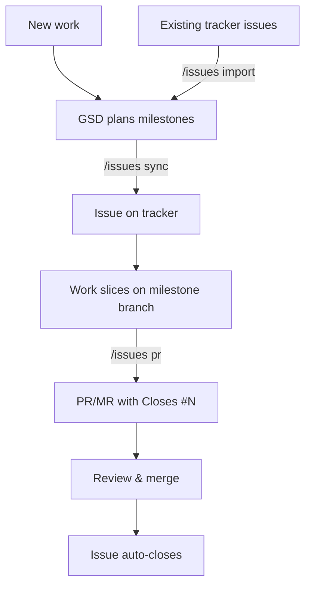
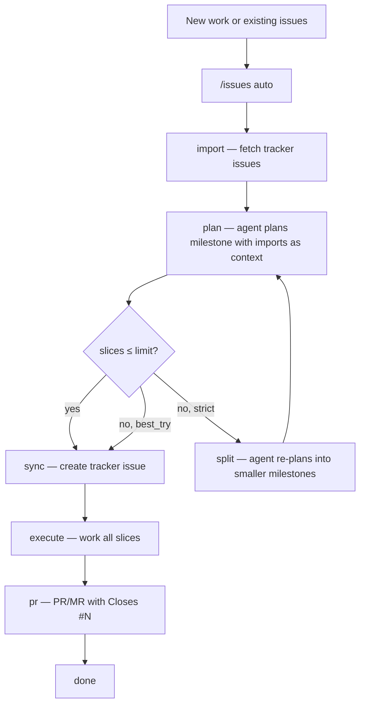

# gsd-issues

A [pi](https://github.com/anthropics/pi) extension that connects [GSD](https://github.com/casimp/gsd) milestones to GitHub and GitLab issue trackers.

GSD breaks work into milestones — right-sized chunks with a bounded number of slices. This extension gives each milestone a corresponding issue on your tracker and creates a PR when the milestone is done. The issue closes automatically when the PR merges. That's the whole loop.

## How It Works

### Manual workflow

Run individual commands to move a milestone through the lifecycle.



**Starting from scratch:** GSD plans your milestones. `/issues sync` creates an issue on the tracker for each one.

**Starting from existing issues:** `/issues import` pulls issues from the tracker as markdown. GSD decomposes them into right-sized milestones. `/issues import --rescope` closes the originals and creates milestone-scoped issues.

**Then, for every milestone:** work the slices on a milestone branch. When done, `/issues pr` creates a PR with `Closes #42` in the body. Merge the PR, the issue closes.

### Auto workflow

`/issues auto` drives the full lifecycle in one command — from existing tracker issues or new work through to a merged PR.



Each phase sends a prompt to the agent via `pi.sendMessage`, waits for completion, then advances. State persists to `.gsd/issues-auto.json` so progress survives restarts.

## Auto Flow Details

### Sizing constraints

Before syncing, the auto-flow validates that the milestone's slice count doesn't exceed `max_slices_per_milestone` (default: **5**). The behavior when a milestone is oversized depends on `sizing_mode`:

- **`best_try`** (default): Warns that the milestone is oversized and proceeds anyway. The agent is asked to split, but the flow continues regardless of the outcome.
- **`strict`**: Blocks until the milestone is right-sized. The agent is asked to split the milestone, then size is re-validated. This retries up to **3 times** before giving up with an error.

### Mutual exclusion

Auto-flow writes `.gsd/issues-auto.lock` and checks `.gsd/auto.lock` (GSD auto-mode) to prevent concurrent orchestration. Both locks use PID liveness checks for crash recovery.

## Providers

Both GitHub (via `gh` CLI) and GitLab (via `glab` CLI) are supported, auto-detected from your git remote.

| | GitHub | GitLab |
|---|---|---|
| Issues | ✓ milestones, labels | ✓ epics, weight, labels |
| PRs | `gh pr create` | `glab mr create` |
| Close | `Closes #N` in PR body | `Closes #N` in MR body |

## Installation

```bash
npm install -g gsd-issues
```

Or add to your pi `settings.json`:

```json
{
  "packages": ["npm:gsd-issues"]
}
```

## Setup

```
/issues setup
```

Walks you through provider detection, project discovery, and writes `.gsd/issues.json`. Or create it manually:

<details>
<summary>GitLab config</summary>

```json
{
  "provider": "gitlab",
  "milestone": "M001",
  "assignee": "username",
  "labels": ["gsd"],
  "done_label": "T::Done",
  "max_slices_per_milestone": 5,
  "sizing_mode": "best_try",
  "gitlab": {
    "project_path": "group/project",
    "project_id": 42,
    "weight_strategy": "fibonacci",
    "epic": "&42"
  }
}
```
</details>

<details>
<summary>GitHub config</summary>

```json
{
  "provider": "github",
  "milestone": "M001",
  "assignee": "username",
  "labels": ["gsd"],
  "max_slices_per_milestone": 5,
  "sizing_mode": "best_try",
  "github": {
    "repo": "owner/repo",
    "close_reason": "completed"
  }
}
```
</details>

## Commands

All via `/issues <subcommand>` in pi.

| Command | What it does |
|---|---|
| `/issues setup` | Interactive config wizard |
| `/issues sync` | Create a tracker issue for the current milestone |
| `/issues pr [id]` | Create a PR/MR from the milestone branch with `Closes #N` |
| `/issues import` | Fetch issues from tracker as markdown for planning |
| `/issues close [id]` | Close a milestone's issue directly (without a PR) |
| `/issues auto` | Run the full milestone lifecycle automatically (import → pr) |
| `/issues status` | Show auto-flow status (stubbed — not yet implemented) |

### Sync

Creates one issue per milestone with title from ROADMAP.md and description from CONTEXT.md. Previews what will be created and asks for confirmation. Skips milestones that already have a mapped issue.

### PR

Creates a PR/MR from the milestone branch to the target branch. Target is resolved from META.json, then falls back to `main`. Use `--target <branch>` to override.

### Import

Fetches open issues, optionally filtered by `--milestone` or `--labels`. For re-scoping existing issues into milestones:

```
/issues import --rescope M003 --originals 10,11,12
```

This closes issues #10, #11, #12 and creates a new milestone-scoped issue for M003.

## LLM Tools

Five tools are registered for agent use (no confirmation prompts):

| Tool | Parameters |
|---|---|
| `gsd_issues_sync` | `milestone_id?` |
| `gsd_issues_close` | `milestone_id?` |
| `gsd_issues_pr` | `milestone_id?`, `target_branch?`, `dry_run?` |
| `gsd_issues_import` | `milestone?`, `labels?`, `state?`, `assignee?`, `rescope_milestone_id?`, `original_issue_ids?` |
| `gsd_issues_auto` | `milestone_id?` |

## Events

Emitted on `pi.events` for other extensions to consume:

| Event | Payload |
|---|---|
| `gsd-issues:sync-complete` | `{ milestone, created, skipped, errors }` |
| `gsd-issues:close-complete` | `{ milestone, issueId, url }` |
| `gsd-issues:pr-complete` | `{ milestoneId, prUrl, prNumber }` |
| `gsd-issues:import-complete` | `{ issueCount }` |
| `gsd-issues:rescope-complete` | `{ milestoneId, createdIssueId, closedOriginals, closeErrors }` |
| `gsd-issues:auto-phase` | `{ phase, milestoneId }` |

## Requirements

- Node.js >= 18
- `gh` CLI (GitHub) or `glab` CLI (GitLab), installed and authenticated
- [pi](https://github.com/anthropics/pi) coding agent

## License

MIT
