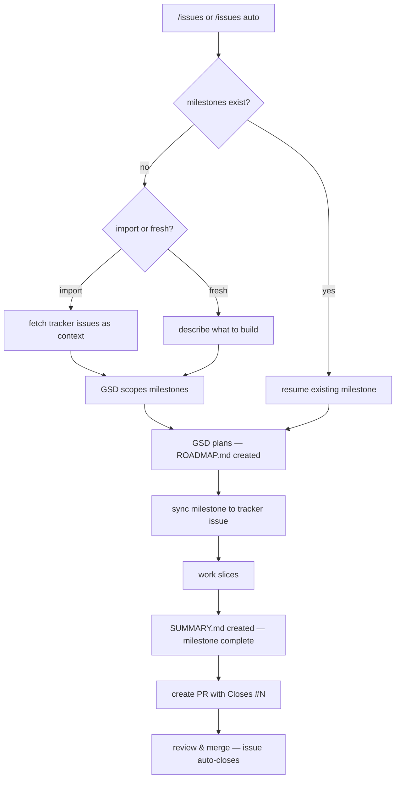

# gsd-issues

A [pi](https://github.com/anthropics/pi) extension that connects [GSD](https://github.com/casimp/gsd) milestones to GitHub and GitLab issue trackers.

GSD breaks work into milestones — right-sized chunks with a bounded number of slices. This extension gives each milestone a corresponding issue on your tracker and creates a PR when the milestone is done. The issue closes automatically when the PR merges. That's the whole loop.

## How It Works

There are three ways to start:

**Start fresh** — no tracker issues yet. `/issues` walks you through describing the work, then GSD creates milestones. As you work, you're prompted to sync and create PRs at the right moments.

**Start from existing issues** — `/issues` and choose "Import from tracker". Open issues are fetched as markdown context, and GSD decomposes them into right-sized milestones.

**Full auto** — `/issues auto` with existing milestones. GSD picks up where it left off and drives planning, execution, sync, and PR automatically — no prompts, no confirmations.

### The flow

Both `/issues` and `/issues auto` follow the same lifecycle. The only difference is confirmation: `/issues` prompts you before outward-facing actions (sync, PR), `/issues auto` does them automatically.



With `/issues`, the sync and PR steps are confirmation prompts — you choose whether to proceed. With `/issues auto`, they fire automatically. Either way, each action fires once per milestone — re-entering the flow won't duplicate syncs or PRs.

### Standalone commands

For one-off use outside the continuous flow, each lifecycle step is available as a standalone command:

- `/issues sync` — create a tracker issue for the current milestone
- `/issues pr` — create a PR/MR from the milestone branch
- `/issues close` — close a milestone's issue directly (without a PR)
- `/issues import` — fetch issues from tracker as markdown for planning

These are escape hatches — use them when you need to run a single step without entering the full flow.

## Providers

Both GitHub (via `gh` CLI) and GitLab (via `glab` CLI) are supported, auto-detected from your git remote.

| | GitHub | GitLab |
|---|---|---|
| Issues | ✓ milestones, labels | ✓ epics, weight, labels |
| PRs | `gh pr create` | `glab mr create` |
| Close | `Closes #N` in PR body | `Closes #N` in MR body |

## Installation

```bash
npm install -g gsd-issues
```

Or add to your pi `settings.json`:

```json
{
  "packages": ["npm:gsd-issues"]
}
```

## Setup

```
/issues setup
```

Walks you through provider detection, project discovery, and writes `.gsd/issues.json`. Or create it manually:

<details>
<summary>GitLab config</summary>

```json
{
  "provider": "gitlab",
  "assignee": "username",
  "labels": ["gsd"],
  "done_label": "T::Done",
  "max_slices_per_milestone": 5,
  "sizing_mode": "best_try",
  "auto_pr": true,
  "gitlab": {
    "project_path": "group/project",
    "project_id": 42,
    "weight_strategy": "fibonacci",
    "epic": "&42"
  }
}
```
</details>

<details>
<summary>GitHub config</summary>

```json
{
  "provider": "github",
  "assignee": "username",
  "labels": ["gsd"],
  "max_slices_per_milestone": 5,
  "sizing_mode": "best_try",
  "auto_pr": true,
  "github": {
    "repo": "owner/repo",
    "close_reason": "completed"
  }
}
```
</details>

Config fields:

| Field | Required | Default | Description |
|---|---|---|---|
| `provider` | yes | — | `"github"` or `"gitlab"` |
| `milestone` | no | — | Milestone ID to target (e.g. `"M001"`). Usually set automatically during scope. |
| `assignee` | no | — | Username to assign issues to |
| `labels` | no | `[]` | Labels applied to created issues |
| `done_label` | no | `"T::Done"` (GitLab) | Label applied when closing an issue |
| `max_slices_per_milestone` | no | `5` | Maximum slices per milestone for sizing validation |
| `sizing_mode` | no | `"best_try"` | `"best_try"` warns on oversized; `"strict"` blocks |
| `auto_pr` | no | `true` | When true, PR is created automatically on milestone completion. Set to `false` to disable auto-PR in hooks. |

## Commands

All via `/issues <subcommand>` in pi.

| Command | What it does |
|---|---|
| `/issues` | Smart entry — continuous flow: scope → prompted sync → work → prompted PR |
| `/issues setup` | Interactive config wizard |
| `/issues scope` | Run the scope flow — describe work, create milestones |
| `/issues sync` | Create a tracker issue for the current milestone (standalone) |
| `/issues pr [id]` | Create a PR/MR from the milestone branch with `Closes #N` (standalone) |
| `/issues import` | Fetch issues from tracker as markdown for planning |
| `/issues close [id]` | Close a milestone's issue directly (without a PR) |
| `/issues auto` | Same lifecycle as `/issues` but with auto-confirmations — no prompts, no pauses |
| `/issues status` | Show status (not yet implemented) |

### Sync

Creates one issue per milestone with title from ROADMAP.md and description from CONTEXT.md. Previews what will be created and asks for confirmation. Skips milestones that already have a mapped issue.

### PR

Creates a PR/MR from the milestone branch to the target branch. Target is resolved from META.json, then falls back to `main`. Use `--target <branch>` to override.

### Import

Fetches open issues, optionally filtered by `--milestone` or `--labels`. For re-scoping existing issues into milestones:

```
/issues import --rescope M003 --originals 10,11,12
```

This closes issues #10, #11, #12 and creates a new milestone-scoped issue for M003.

## LLM Tools

Four tools are registered for agent use (no confirmation prompts):

| Tool | Parameters |
|---|---|
| `gsd_issues_sync` | `milestone_id?` |
| `gsd_issues_close` | `milestone_id?` |
| `gsd_issues_pr` | `milestone_id?`, `target_branch?`, `dry_run?` |
| `gsd_issues_import` | `milestone?`, `labels?`, `state?`, `assignee?`, `rescope_milestone_id?`, `original_issue_ids?` |

## Events

Emitted on `pi.events` for other extensions to consume:

| Event | Payload |
|---|---|
| `gsd-issues:sync-complete` | `{ milestone, created, skipped, errors }` |
| `gsd-issues:close-complete` | `{ milestone, issueId, url }` |
| `gsd-issues:pr-complete` | `{ milestoneId, prUrl, prNumber }` |
| `gsd-issues:import-complete` | `{ issueCount }` |
| `gsd-issues:rescope-complete` | `{ milestoneId, createdIssueId, closedOriginals, closeErrors }` |
| `gsd-issues:scope-complete` | `{ milestoneIds, count }` |
| `gsd-issues:auto-start` | `{ milestoneIds, trigger }` |
| `gsd-issues:auto-sync` | `{ milestoneId }` |
| `gsd-issues:auto-pr` | `{ milestoneId }` |

## Requirements

- Node.js >= 18
- `gh` CLI (GitHub) or `glab` CLI (GitLab), installed and authenticated
- [pi](https://github.com/anthropics/pi) coding agent

## License

MIT
